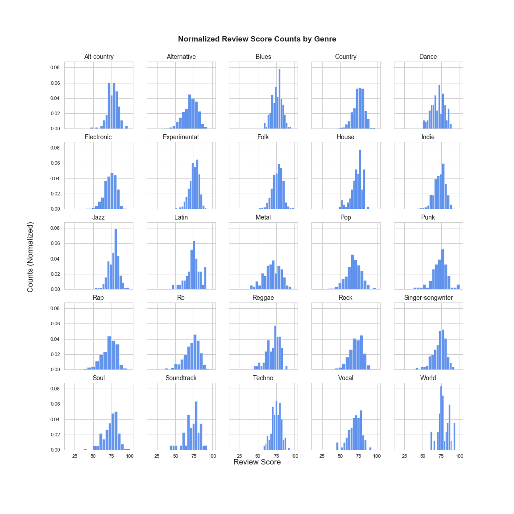
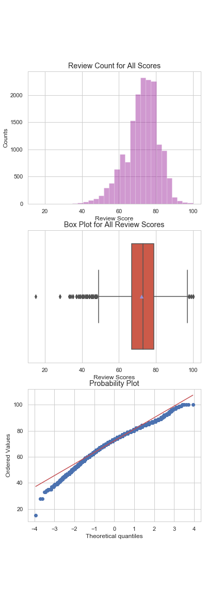
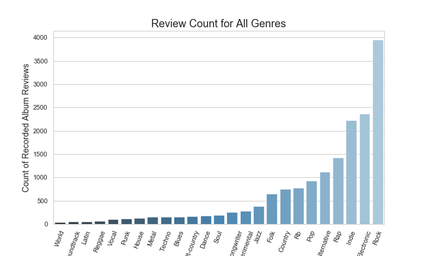
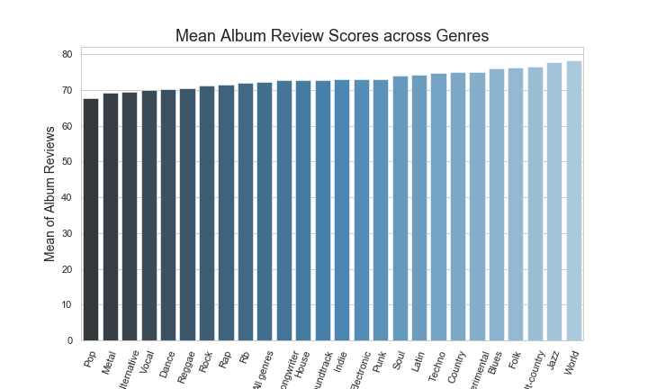
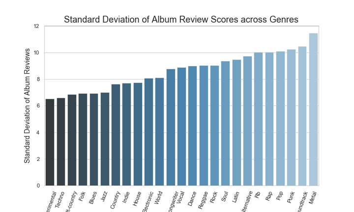

# Reviews By Genre: Analyzing How Album Review Scores Change Across Genres
The goal of this project is to explore how albums across various genres are reviewed by critics, based on normalized album reviews from Metacritic. While data across all genres are analyzed, I take a deeper look in particular at how rap album reviews differ from other genres.

# Background & Inspiration
Like most people, I'm a big fan of music. When I see recommendations on music, whether it be my from friends, publications, or social media, I add that new suggestion to a running list I keep on my Notes app. One of the albums to which I recently listened is "Don't Quit Your Day Job!", an album by Consequence (a former GOOD Music signee) that dropped in 2007. After a few spins, I wondered how this album was received by critics when it initially came out over a decade ago. I went to [Metacritic](https://www.metacritic.com) to see if I could find any content on the album. The website assigns scores to albums (similar to Rotten Tomatoes), based on its own normalizing criteria (read more about it [here](https://www.metacritic.com/faq#item11)). While the album ultimately didn't have any reviews on the site, it did lead me into a rabbit hole of reading other available reviews, and in this process I began to think: are there discrepancies in how genres are ultimately reviewed and scored? Do some tend to be treated more leniently or harshly than others? My motivation was to see if I could draw real insights from the available music review scores.

# Hypothesis
While I explored all of the data I received across all genres (see below for my EDA), I keyed in on the available reviews for rap albums. I compared rap to all other genres. I had no specific theories on the genres from which rap would be different, but I felt that there had to be differences with at least a handful.

* H0: The mean album review score from rap and each other genre, respectively, is the same 
* HA: The mean album review score from rap and each other genre, respectively, is different

These analyses were completed using a two-tailed Welch's t-test between rap and each genre respectively to account for the differences in sample size. All genres analyzed had a sample size of at least 37. I used an alpha of 0.05 with a Bonferroni correction to account for familywise errors across the 24 tests completed.

# Data
I scraped all data from [Metacritic](https://www.metacritic.com/browse/albums/genre/date/alt-country), which conveniently has a "Browse by Genre" page. All available data from all available genres were collected, except for "comedy" and "psychedelic" due to limited data. My webscraper uses Beautiful Soup, and while collecting this data it stores it dynamically into a MongoDB database. I collected the scores (called Metascores by the site), album titles, artists, and dates. Each genre was placed into its own collection.

Upon completion, I used an SFTP to grab all of this data, and using PyMongo & Pandas I converted the collections into dataframes for easy manipulation.

In total, I collected 16,604 rows of data across genres. My analysis focuses entirely on the Metascore values.

# Exploratory Data Analysis
Once I organized my data, I was immediately interested in seeing the data presented in a raw way. I created normalized histograms for Metascores for each genre (25 in total) so I could quickly see the shapes of these plots, and while we get some skews and abnormalities, the overall shape of each plot is roughly normal.  
  
I also made plots of the data for all genres combined. These include a histogram of raw counts, a boxplot, and a probability plot. The goal here was to assess just how normal the population distribution was, and through these visualizations we can feel more confident about the data's normality.  
  
Additional exploratory plots include bar graphs for sample statistics including total review count, mean review scores, and standard deviations. Discoveries here include seeing that the mean of genre reviews across all genres has a range of roughly 10 and the standard deviation has a range of 5 of 6. We also find that the genres with the most recorded scores include rock (3948, almost double second place), electronic (2358), and indie (2219), and that the genres with the fewest recorded scores include world (37), soundtrack (51), and latin (55).  

# Results
Using the design outlined under the [Hypothesis](#hypothesis), I compared rap to the other 24 genres. Interesting enough, we failed to reject the null hypothesis and rejected the null hypothesis 12 times each. We rejected the null hypothesis that the means of rap were equal to other genres for each alt-country, alternative, blues, country, electronic, experimental, folk, indie, jazz, pop, techno, and world. In fact when looking at the distributions of these samples, the mean of rap reviews is lower in all instances outside of alternative & pop!

We failed to reject the null hypothesis for the remaining 12 genres, which include dance, house, latin, metal, punk, R&B, reggae, rock, singer-songwriter, soul, soundtrack, and vocal.

# Technologies
* Python (including Seaborn, Matplotlib, PyMongo, Beautiful Soup, SciPy, Pandas, and Numpy)
* MongoDB
* Amazon EC2

# Looking Forward
I'm particularly interested in knowing if there are different inferences we can draw between user and critic scores. Metacritic assigns scores by taking critic reviews and assigning a number that is specific to their system (you can read more about it [here](https://www.metacritic.com/faq#item11)) - users provide scores between 0 and 10. Given this discrepancy, I wonder if there are material differences between the two (are they the same in the aggregate, or do users tend to be harsher/lenient?)

As I grow my skills, I'd like to return and look more specifically at user reviews and their associated comments. I believe I can gather real insights using natural language processing to see how comments vary across the range of reviews.

Lastly, I'd also be interested in exploring if reviews have changed over the years. Data for dates is not quite as robust across the site, but given the vast number of websites dedicated to music, I'm sure it could be done by obtaining and combining multiple datasets if not solely through Metacritic.

# Acknowledgements
A big thanks to Dan Rupp, Juliana Duncan, Peter Galea, and Austin Penner, each of whom poured a lot of their time and energy in helping me complete this project. A special thanks, too, to [Metacritic](https://www.metacritic.com) which is where I received all data used for this project.
